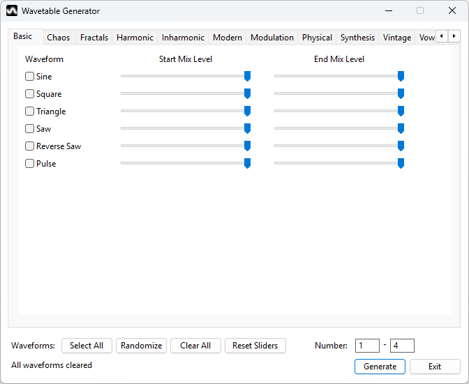

# Wavetable Generator

A comprehensive Windows application for creating custom wavetables compatible with popular synthesizers like Surge XT, Bitwig, Serum, Vital, and any other synth that supports wavetable import.


## 🎵 Overview

**Wavetable Generator** is a professional-grade tool for creating high-quality, bandlimited wavetables for music production. With an extensive library of 72 waveform types spanning 11 categories, advanced post-processing effects, intelligent morphing, and powerful batch generation capabilities, it's your complete solution for wavetable sound design.

### ✨ Key Features

- **72 Waveform Types** across 11 organized categories
- **Chaos Theory & Fractals** - Lorenz, Rössler, Hénon, Weierstrass, Mandelbrot, and more
- **Advanced Synthesis** - FM, Ring Mod, Phase Distortion, Wavefold, Hard Sync
- **Vintage Synth Emulation** - Minimoog, Prophet-5, Juno, TB-303, ARP Odyssey, Yamaha CS-80, Korg MS-20, PPG Wave, Oberheim SEM
- **Vowel Formants** - A, E, I, O, U vowel sounds with diphthongs
- **Inharmonic Series** - Metallic, bell-like, and stretched harmonic content
- **Post-Processing Effects** - Distortion, filters, bit crushing, sample rate reduction, wavefold, symmetry operations
- **Spectral Processing (FFT-based)** - Spectral decay, tilt, gate, shift, phase randomization powered by KissFFT
- **Wavetable Import & Analysis** - Load, analyze, and reverse-engineer existing wavetables using spectral matching
- **Intelligent Batch Generation** - Create hundreds of unique wavetables automatically
- **Professional Quality** - 4x oversampling, PolyBLEP, anti-aliasing, global normalization
- **Auto-Save Settings** - Your configuration is automatically preserved between sessions
- **Responsive UI** - Multi-threaded generation with progress tracking and cancellation

## ⬇️ Download

Download the latest version of the executable using the link below:

[**Download WavetableGenerator.exe**](https://github.com/andrewklinkhamer/WavetableGenerator/releases/download/v1.0.0/WavetableGenerator.exe)

## 📦 Installation & Building

### Prerequisites

- **Windows 10** or later (64-bit)
- **Visual Studio 2022** (Community Edition or higher)
- **Windows SDK 10.0** or later

### Building from Source

1. **Clone the repository:**
```bash
git clone https://github.com/andrewklinkhamer/WavetableGenerator.git
cd WavetableGenerator
```

2. **Open** `WavetableGenerator.sln` in Visual Studio 2022

3. **Select** your build configuration (Debug or Release) and platform (x64)

4. **Build** the solution (F7 or Build → Build Solution)

5. **Run** the application (F5 or Debug → Start Debugging)

The executable will be located in:
- Debug: `x64/Debug/WavetableGenerator.exe`
- Release: `x64/Release/WavetableGenerator.exe`

## 📖 User Guide

### Interface Overview

The application features a **tabbed interface** organizing waveforms by category, with dedicated tabs for import, effects, and settings.

#### Tab Organization

**Waveform Tabs (Alphabetical):**
1. **Basic** - Sine, Square, Triangle, Saw, Reverse Saw, Pulse
2. **Chaos Theory** - Lorenz, Rössler, Hénon, Duffing, Chua, Logistic Chaos
3. **Fractals** - Weierstrass, Cantor, Koch, Mandelbrot
4. **Harmonic** - Odd/Even Harmonics, Harmonic Series, Sub-Harmonics, Formant, Additive
5. **Inharmonic** - Stretched/Compressed Harmonics, Metallic, Clangorous, Karplus-Strong, Stiff String
6. **Modern** - Supersaw, PWM Saw, Parabolic, Double Sine, Power, Exponential, Stepped, Noise, etc.
7. **Modulation** - Ring Mod, Amplitude Mod, Frequency Mod, Cross Mod, Phase Mod
8. **Physical** - String, Brass, Reed, Vocal, Bell
9. **Synthesis** - Simple/Complex FM, Phase Distortion, Wavefold, Hard Sync, Chebyshev
10. **Vintage** - Minimoog, Prophet-5, Juno, TB-303, PPG Wave, Oberheim SEM
11. **Vowels** - Vowel A, E, I, O, U, Diphthong

**Utility Tabs:**
- **Import** - Load and analyze existing wavetables
- **Effects** - Post-processing and modulation effects
- **Spectral Effects** - FFT-based frequency-domain processing
- **Settings** - Output format, generation options, advanced settings

### Quick Start: Creating Your First Wavetable

#### **Single Wavetable (Precise Control)**

1. **Select waveforms** across tabs by checking boxes
   - Each waveform has **Start** and **End** sliders (0-100%)
   - Start: Weight in the first frame
   - End: Weight in the last frame (when morphing is enabled)

2. **Enable Morphing** (optional, on Settings tab)
   - Check **Enable Morphing** for smooth frame transitions
   - Select frame count: 1, 64, 128, 256, 512, or 1024
   - More frames = smoother evolution, larger file size

3. **Apply Effects** (optional)
   - **Effects tab:** Distortion, filters, bit crushing, wavefold, symmetry ops
   - **Spectral Effects tab:** Spectral decay, tilt, gate, phase randomization
   - See [Effects Guide](#%EF%B8%8F-effects-guide) below

4. **Generate**
   - Click **Generate** (bottom right)
   - Choose save location
   - Your wavetable is created with an auto-generated descriptive name

#### **Batch Generation (Exploration & Discovery)**

1. **Select a palette** of waveforms (10-20 recommended)
   - Choose from multiple tabs for variety
   - **Start/End sliders define weight ranges**: Random generation picks a random weight between Start and End for each waveform
   - Example: Start=50%, End=100% means this waveform will always be used with medium-to-high intensity

2. **Set the range** (bottom right)
   - **Number:** Min-Max waveforms per table (e.g., "2-5")
   - This controls the complexity of each generated table

3. **Click Generate**
   - Choose output folder
   - Enter number of wavetables to generate (e.g., 100)
   - Generation runs in a background thread (UI remains responsive)

4. **Review results**
   - Each file has a unique name based on its content
   - Morphing and frame counts are randomized
   - Import your favorites to see exactly how they were made!

### Waveform Controls

Each waveform has:
- **Checkbox** - Enable/disable this waveform
- **Start Slider** - Amplitude/weight in starting frame (0-100%)
- **End Slider** - Amplitude/weight in ending frame (0-100%, used with morphing)

**Utility Buttons (bottom left):**
- **Select All** - Selects all waveforms on all tabs
- **Randomize** - Randomly selects 1-8 waveforms across all tabs and sets random slider values
  - Press again to clear and re-randomize
- **Clear All** - Unchecks all waveforms on all tabs
- **Reset Sliders** - Reset all sliders to 100% (keeps checkboxes)

**Output Controls (bottom right):**
- **Number** - Range for random generation (Min-Max waveforms)
- **Generate** - Create wavetable(s) or cancel ongoing generation
- **Exit** - Close application (settings auto-saved on exit)

## 🎛️ Effects Guide

### PWM & Morphing (Effects Tab)

**PWM Duty Cycle (0-100%)**
- Controls pulse width for pulse-based waveforms
- 50% = square wave, other values create asymmetry
- Real-time slider label updates

**Morph Curve**
- **Linear** - Constant transition rate
- **Exponential** - Slow start, fast end (accelerates)
- **Logarithmic** - Fast start, slow end (decelerates)
- **S-Curve** - Smooth at both ends (sigmoid)
- **Smooth Step** - Very smooth acceleration/deceleration

### Distortion

**Types:**
- **Soft Clip** - Smooth saturation (tanh)
- **Hard Clip** - Brick-wall limiting
- **Tube** - Warm tube-style saturation
- **Foldback** - Wavefolding distortion

**Amount:** 0-100% intensity (uses 4x oversampling)

### Filters

**Low-Pass Filter**
- Cutoff: 100-20,000 Hz
- Removes high frequencies
- Good for warming or de-harshening

**High-Pass Filter**
- Cutoff: 20-2,000 Hz
- Removes low frequencies
- Good for thin/bright sounds or removing DC offset

### Bit Crushing

- **Bit Depth:** 1-16 bits
- Lower bits = more digital/lo-fi character
- Uses 4x oversampling to prevent aliasing
- Great for retro video game sounds

### Sample Rate Reduction

- **Factor:** 1x to 32x reduction
- **Enable:** Toggle on/off
- Simulates lower sample rates by holding sample values (sample-and-hold)
- Creates "aliasing" and robotic artifacts
- Uses 4x oversampling to emulate the effect cleanly without unintentional aliasing
- Perfect for chiptune, glitch, and lo-fi textures

### Symmetry Operations

- **Mirror H** - Horizontal mirror (time symmetry)
- **Mirror V** - Vertical mirror (phase inversion)
- **Invert** - Invert waveform amplitude
- **Reverse** - Reverse time direction

**Tip:** Combine multiple symmetry ops for unique transformations!

### Wavefold

- **Amount:** 0-100%
- Creates complex harmonics by folding the waveform
- Uses 4x oversampling for clean results
- Excellent for aggressive, metallic timbres

### Spectral Decay (Spectral Effects Tab)

**Frequency-domain effect using FFT processing**

- **Amount:** 0-100% decay intensity
- **Curve:** 1.0-5.0 exponential curve shaping
  - 1.0 = Linear decay slope
  - 2.0+ = More aggressive high-frequency roll-off

**How it works:**
- Progressively attenuates higher frequencies using Fast Fourier Transform
- Creates dark, warm, vintage, or lo-fi characteristics
- Higher frequencies decay more than lower frequencies

**Use cases:**
- **Analog Warmth** - Simulate tape saturation or vintage gear
- **Distance Effect** - Make sounds seem farther away
- **Lo-Fi/Vintage** - Emulate old synthesizers or degraded recordings
- **Spectral Morphing** - Create evolving timbral changes across frames
- **Bass Enhancement** - Clean up high-frequency noise in bass patches

**Tip:** Combine with low-pass filtering for extreme darkening effects!

### Spectral Tilt (Spectral Effects Tab)

**Frequency-domain effect using FFT processing**

- **Amount:** -100% (bass cut) to +100% (treble cut)
- **0% = Flat response** (no change)
- **Negative values** = Cut bass, boost treble (brighter)
- **Positive values** = Boost bass, cut treble (darker)

**How it works:**
- Applies linear frequency slope across the spectrum
- Similar to professional "tilt EQ" found in mixing consoles
- One control for tonal balance adjustment

**Use cases:**
- **Quick Tonal Balance** - Adjust brightness with single control
- **Modern/Vintage Character** - Negative for modern/bright, positive for vintage/warm
- **Complement Spectral Decay** - Use together for complex frequency shaping
- **Mix Preparation** - Pre-shape wavetables for specific mix contexts

**Tip:** Start with small adjustments (±20-30%) for subtle but effective changes!

### Spectral Gate (Spectral Effects Tab)

**Frequency-domain effect using FFT processing**

- **Threshold:** 0-100% (percentage of maximum magnitude)
- **0% = No gating** (all frequencies pass)
- **High values** = Only loudest frequencies pass

**How it works:**
- Analyzes frequency content and removes bins below threshold
- Based on magnitude relative to the loudest frequency component
- Creates "sparser" spectra with fewer harmonics

**Use cases:**
- **Noise Reduction** - Remove low-level artifacts or noise floor
- **Harmonic Simplification** - Reduce number of partials for cleaner sound
- **Gritty Effects** - High thresholds (60-80%) create lo-fi character
- **Cleanup Chaos/Fractals** - Tame overly complex waveforms

**Tip:** Use low thresholds (5-15%) for transparent cleanup, high thresholds (50-80%) for creative effects!

### Spectral Shift (Spectral Effects Tab)

**Frequency-domain effect using FFT processing**

- **Amount:** -100 to +100 frequency bins
- **0 = No shift**
- **Negative values** = Shift spectrum down (lower pitch/timbre)
- **Positive values** = Shift spectrum up (higher pitch/timbre)

**How it works:**
- Translates the entire frequency spectrum up or down
- Disrupts harmonic relationships (linear shift vs. logarithmic pitch)
- Creates metallic, dissonant, and inharmonic timbres

**Use cases:**
- **Metallic Textures** - Turn harmonic waves into bells/chimes
- **Voice Disguise** - Robot/alien voice effects
- **Dissonance** - Create tension or horror soundscapes
- **Inharmonic Bass** - Add unique character to low-end patches

**Tip:** Small shifts (±1-5) create subtle detuning, large shifts create complete transformation!

### Phase Randomization (Spectral Effects Tab)

**Frequency-domain effect using FFT processing**

- **Amount:** 0-100% randomization intensity
- **0% = Original phase relationships**
- **100% = Completely randomized phases**

**How it works:**
- Preserves magnitude spectrum (frequency content)
- Randomizes phase relationships between harmonics
- Changes waveform shape while maintaining timbre

**Use cases:**
- **Create Variations** - Generate unique waveforms from existing ones
- **Batch Generation** - Add unpredictability to random wavetables
- **Sound Design Exploration** - Discover unexpected timbres
- **Break Up Patterns** - Eliminate periodic artifacts or "phasiness"

**Why it's powerful:**
- Same frequency content, completely different waveform
- Used in professional synths (Serum, Vital, Pigments)
- Creates sounds impossible to achieve with time-domain effects
- Excellent for evolving/organic textures

**Tip:** Try 30-50% for subtle variation, 80-100% for radical transformation!

## 📥 Wavetable Import & Analysis

The **Import tab** lets you load existing wavetables and reverse-engineer them.

### Workflow

1. **Click "Load Wavetable..."**
   - Select a `.wt` or `.wav` file
   - Import info displays: frames, samples/frame, sample rate

2. **Select a frame** from the dropdown
   - Choose which frame to analyze

3. **Click "Use as Start Frame" or "Use as End Frame"**
   - Application analyzes the frame using **spectral matching** (FFT-based)
   - Compares magnitude spectra in frequency domain
   - Finds best matching waveforms from the 72 waveform library
   - **More accurate than time-domain correlation** (phase-independent)
   - **Automatically updates UI:**
     - Checks matching waveform boxes
     - Sets slider values based on spectral similarity
     - Switches to relevant tabs to show selections

4. **Refine and generate**
   - Tweak the auto-selected waveforms
   - Add effects or adjust morphing
   - Generate your modified version

5. **Clear import** when done
   - Click "Clear" to unload the wavetable

**Use cases:**
- **Recreate** existing wavetables with modifications
- **Learn** what waveforms create specific sounds
- **Start** from imported frames and evolve them
- **Compare** commercial wavetables to your designs

## ⚙️ Settings Tab

### Output Settings

**Folder**
- Browse for output directory
- Used for both single and batch generation

**Output Format**
- **`.wt`** - Surge XT/Bitwig format (recommended)
  - 32-bit float samples
  - Supports any frame count (1-1024)
  - Widely compatible
- **`.wav`** - Standard WAV audio file
  - 16-bit signed integer
  - 256 frames fixed
  - Use for synths that prefer WAV

**Audio Preview**
- Generates a 3-second playable audio file
- Always outputs as `.wav` regardless of format setting
- Useful for auditioning wavetables outside a synth

### Generation Options

**Enable Morphing**
- Creates smooth transitions from start → end frame
- Disabling sets output to 1 frame (static wavetable)
- Enables/disables the Frames dropdown

**Frames** (requires Morphing)
- 1, 64, 128, 256, 512, or 1024
- More frames = smoother evolution but larger files
- **256** is the sweet spot for most uses

**Count** (for random generation)
- Dialog appears when generating multiple wavetables
- Enter desired quantity (e.g., 100)

### Advanced Settings

**Max Harmonics** (1-16)
- Controls harmonic content in harmonic-type waveforms
- **1-5 (Clean)** - Pure, simple tones (bass/sub-bass)
- **6-8 (Balanced)** - Default, good richness without artifacts
- **9-12 (Rich)** - Complex timbres (leads/pads)
- **13-16 (Very Rich)** - Extreme harmonics, may cause aliasing

⚠️ **Warning:** Values above 8 may produce aliasing at high frequencies. Test in your synth!

### Auto-Save Settings

**✨ Your settings are automatically saved on exit and loaded on startup!**

No manual save/load buttons needed. Just close the app - everything is preserved:
- Output folder and format
- Generation options (morphing, frames, count)
- All effect settings (distortion, filters, etc.)
- Every waveform checkbox and slider value (all 72 waveforms!)
- Advanced settings (max harmonics)

Settings are stored in `WavetableGenerator.ini` next to the executable.

## 🎨 Complete Waveform Catalog

### Basic Waveforms (6)
- **Sine** - Pure sinusoid, fundamental building block
- **Square** - Equal duty cycle, hollow sound
- **Triangle** - Smooth, warm, mellow
- **Saw** - Bright, full harmonic content
- **Reverse Saw** - Saw wave reversed in time
- **Pulse** - Variable duty cycle (affected by PWM)

### Chaos Theory (6)
- **Lorenz** - Lorenz attractor projection
- **Rössler** - Rössler attractor projection
- **Hénon** - Hénon map chaotic oscillator
- **Duffing** - Duffing forced nonlinear oscillator
- **Chua** - Chua's circuit simulation
- **Logistic Chaos** - Logistic map in chaotic regime

### Fractals (4)
- **Weierstrass** - Continuous but nowhere differentiable
- **Cantor** - Devil's staircase function
- **Koch** - Koch curve projection (crystalline)
- **Mandelbrot** - Mandelbrot set boundary sampling

### Harmonic Waveforms (6)
- **Odd Harmonics** - 1st, 3rd, 5th, 7th... (hollow/clarinet-like)
- **Even Harmonics** - 2nd, 4th, 6th, 8th... (octave character)
- **Harmonic Series** - Full harmonic series (1/k amplitude)
- **Sub Harmonics** - Fundamental with sub-harmonics
- **Formant** - Vocal formant peaks
- **Additive** - General additive synthesis

### Inharmonic Series (6)
- **Stretched Harmonics** - Wider than natural harmonic spacing
- **Compressed Harmonics** - Tighter than natural spacing
- **Metallic** - Bell-like inharmonic partials
- **Clangorous** - Gong/cymbal inharmonic spectrum
- **Karplus-Strong** - Plucked string algorithm
- **Stiff String** - Piano-like inharmonicity

### Modern/Digital (13)
- **Supersaw** - Detuned sawtooth stack
- **PWM Saw** - Pulse-width modulated sawtooth
- **Parabolic** - Smooth parabolic curve
- **Double Sine** - Two octaves of sines multiplied
- **Half Sine** - Rectified sine wave
- **Trapezoid** - Trapezoidal waveform
- **Power** - Exponential power function
- **Exponential** - Exponential curve
- **Logistic** - Sigmoid/logistic function
- **Stepped** - Quantized/staircase wave
- **Noise** - Bandlimited white noise
- **Procedural** - Procedurally generated
- **Sinc** - Mathematical sin(x)/x function

### Modulation Synthesis (5)
- **Ring Mod** - Ring modulation (metallic)
- **Amplitude Mod** - Amplitude modulation
- **Frequency Mod** - Frequency modulation (deep FM)
- **Cross Mod** - Bidirectional FM
- **Phase Mod** - Phase modulation synthesis

### Physical Models (5)
- **String** - Plucked string model
- **Brass** - Brass instrument model
- **Reed** - Reed instrument (clarinet/sax)
- **Vocal** - Vocal tract with formants
- **Bell** - Inharmonic bell simulation

### Synthesis Waves (6)
- **Simple FM** - Single modulator FM
- **Complex FM** - Dual modulator FM
- **Phase Distortion** - Phase-modulated sine
- **Wavefold** - Wavefolded sine
- **Hard Sync** - Hard-sync oscillator
- **Chebyshev** - Chebyshev polynomial waveshaping

### Vintage Synth Emulation (9)
- **ARP Odyssey** - Raw, aggressive oscillators
- **Yamaha CS-80** - Lush, warm, thick pads
- **Juno** - Juno chorus character
- **Minimoog** - Minimoog-style detuned saw
- **Korg MS-20** - Aggressive, raw filter character
- **Oberheim** - Oberheim SEM multi-mode
- **PPG Wave** - PPG Wave digital wavetable
- **Prophet-5** - Prophet-5 smooth saw
- **TB-303** - TB-303 bright acidic saw

### Vowel Formants (6)
- **Vowel A** - "Ah" sound (father)
- **Vowel E** - "Eh" sound (bed)
- **Vowel I** - "Ee" sound (see)
- **Vowel O** - "Oh" sound (go)
- **Vowel U** - "Oo" sound (boot)
- **Diphthong** - Morphing vowel (A→I)

**Total: 72 unique waveform types!**

## 🔧 Technical Details

### Audio Specifications

- **Sample Rate:** 44,100 Hz
- **Internal Processing:** 32-bit float
- **Output Bit Depth:**
  - `.wt` format: 32-bit float
  - `.wav` format: 16-bit signed integer
- **Default Samples/Frame:** 2048 (power of 2)
- **Frame Range:** 1-1024

### Anti-Aliasing Technology

**PolyBLEP (Polynomial Band-Limited Step)**
- Applied to discontinuous waveforms (square, saw, pulse, triangle)
- Eliminates aliasing at waveform edges
- Preserves sharp transients without artifacts

**4x Oversampling**
- Used for all non-linear effects (distortion, bit crush, wavefold)
- Pushes harmonic content above Nyquist frequency
- Enables clean downsampling without aliasing

**Lanczos Windowed-Sinc Interpolation**
- High-quality resampling for oversampling
- Minimal spectral leakage
- Professional studio-grade quality

**FIR Low-Pass Filtering**
- Anti-aliasing filter before downsampling
- Removes content above Nyquist frequency
- Ensures clean, artifact-free output

**Bandlimited Harmonics**
- Harmonic waveforms automatically limit max harmonics
- Prevents aliasing in harmonic series
- Configurable via Max Harmonics setting

**Spectral Processing (FFT-based)**
- Uses KissFFT for efficient frequency-domain processing
- Real-valued FFT optimized for audio signals
- 2048-sample FFT size (configurable internally)
- Magnitude/phase representation for clean processing
- Automatic padding to power-of-2 for compatibility
- **4 spectral effects:** Decay, Tilt, Gate, Phase Randomization
- **Enhanced import analysis:** Spectral matching for better accuracy

### Effect Processing Chain

Effects are applied in this order:
1. Base waveform generation (with PolyBLEP if needed)
2. Waveform blending/mixing
3. DC offset removal
4. **Symmetry Operations** (reverse, mirror, invert)
5. **Non-Linear Effects** (distortion, wavefold, bit crush - with 4x oversampling)
6. **Time-Domain Filtering** (high-pass and/or low-pass)
7. **Spectral Effects** (spectral decay, tilt, gate, phase randomization - FFT processing)
8. **Global Normalization** (preserves relative amplitudes)

**Note:** Order matters! Spectral effects process after filtering, allowing complex frequency shaping. Phase randomization applies last for creative variation.

### Normalization Strategy

**Global Normalization**
- Analyzes peak amplitude across ALL frames
- Normalizes entire wavetable to this peak
- **Preserves relative amplitude relationships**
- Maintains smooth morphing without volume jumps

This is superior to per-frame normalization which would destroy morphing dynamics.

### File Formats

**`.wt` Format (Surge XT / Bitwig)**
```
Header (8 bytes):
  uint32: samplesPerFrame (must be power of 2)
  uint32: numFrames (1-1024)

Data (variable):
  float32[]: samples (all frames interleaved)
    - Frame 0: sample[0...samplesPerFrame-1]
    - Frame 1: sample[samplesPerFrame...2*samplesPerFrame-1]
    - ... etc.
```

**`.wav` Format**
```
Format: RIFF WAV (PCM)
Channels: 1 (Mono)
Sample Rate: 44100 Hz
Bit Depth: 16-bit signed integer
Frames: 256 (fixed for wavetable compatibility)

Metadata:
  - clm chunk: "SeamlessLoop" marker
  - cue chunk: Loop point at sample 0
  - smpl chunk: MIDI sampler loop region
```

## 💡 Tips & Best Practices

### Sound Design Tips

**For Clean, Musical Sounds:**
- Use morphing with 256+ frames
- Keep max harmonics at 6-8
- Apply effects subtly (20-40% range)
- Start with basic waveforms and add complexity

**For Experimental/Aggressive Sounds:**
- Use chaos theory or fractal waveforms
- Push distortion and wavefold to 80%+
- Combine inharmonic series with modulation
- Use extreme bit crushing (1-4 bits)

**For Vintage/Lo-Fi Character:**
- Enable spectral decay with 40-70% amount
- Use curve values of 1.5-2.5 for natural roll-off
- Add spectral tilt (+30% to +60%) for extra warmth
- Combine with soft clipping for tape-like saturation
- Try bit crushing (8-12 bits) with spectral effects for retro digital character

**For Unique/Experimental Sounds:**
- Use phase randomization (50-100%) on familiar waveforms
- Combine spectral gate (40-60%) with phase randomization
- Stack multiple spectral effects for complex processing
- Try spectral tilt extremes (±80-100%) for radical tonal shifts

**For Evolving Pads:**
- Enable morphing with 512+ frames
- Use asymmetric start/end sliders (e.g., 100% start, 30% end)
- Try S-Curve or Smooth Step morph curves
- Combine harmonic and vowel formants

**For Bass Wavetables:**
- Keep max harmonics low (4-6)
- Use basic waveforms (sine, triangle, saw)
- Apply subtle soft clipping
- Avoid high-pass filtering
- Use spectral decay (10-30%) to tame harsh high frequencies without losing punch

### Workflow Tips

**Discovery Mode:**
1. Select 15-20 diverse waveforms
2. Set Number range to 3-6
3. Generate 100 wavetables
4. Audition in your synth, keep 10-20 favorites
5. Import favorites to see how they're made
6. Tweak and regenerate refined versions

**Precision Mode:**
1. Start with 1-2 waveforms
2. Set sliders to specific values
3. Enable morphing with 256 frames
4. Generate and test
5. Import to verify, adjust if needed
6. Add effects incrementally

**Batch Library Creation:**
1. Create genre-specific folders (Bass, Leads, Pads, FX)
2. Select appropriate waveform palettes for each
3. Generate 50-100 per category
4. Organize by timbre characteristics
5. Create preset folders in your synth

### Performance Tips

- Large batch generations (500+) may take several minutes
- UI remains responsive - you can browse tabs during generation
- Click Generate (now "Cancel") button to stop at any time
- Settings auto-save, so feel free to close and resume later

### Avoiding Common Issues

**Aliasing:**
- Keep max harmonics ≤ 8
- Test at high pitches (C6+)
- Reduce effect intensity if artifacts appear
- Use soft clip instead of hard clip

**File Compatibility:**
- Use `.wt` format for Surge, Bitwig, Vital
- Use `.wav` if your synth prefers WAV files
- 256 frames is the most compatible frame count
- 2048 samples/frame is universal standard

**Import Accuracy:**
- Analysis uses spectral matching (frequency-domain comparison)
- More accurate than time-domain correlation for harmonically rich waveforms
- Phase-independent matching (better for processed/filtered wavetables)
- Use as starting point, not exact recreation
- Some commercial wavetables use proprietary techniques
- Combine analysis with your own adjustments and effects

## 🐛 Troubleshooting

**Q: Wavetable loads but makes no sound**
✓ Verify file format matches synth requirements (`.wt` vs `.wav`)
✓ Check wavetable isn't silent (use Audio Preview)
✓ Ensure synth's wavetable oscillator is enabled
✓ Try generating a simple sine wave to test

**Q: I hear clicking or pops**
✓ This is aliasing - reduce max harmonics to 6-8
✓ Lower distortion or wavefold amount
✓ Use soft clipping instead of hard clipping
✓ Enable morphing for smoother frame transitions

**Q: Sound is too quiet**
✓ This is normal due to global normalization
✓ Increase gain in your synth or mixer
✓ Use fewer waveforms or higher slider values
✓ Global normalization prevents clipping but reduces peak level

**Q: Generation is stuck/frozen**
✓ Check progress bar - large batches take time
✓ UI should remain responsive (try clicking tabs)
✓ Click "Cancel" button to stop generation
✓ If truly frozen, close app and restart (settings are auto-saved)

**Q: Import analysis doesn't match original**
✓ Analysis uses correlation (finds *similar*, not exact)
✓ Some wavetables use techniques not in our library
✓ Use as starting point and refine manually
✓ Try analyzing different frames - later frames may match better

**Q: Random generation creates similar files**
✓ Increase your waveform palette (select more waveforms)
✓ Adjust Number range for more variety
✓ Generator checks for duplicates and skips them
✓ If still an issue, reduce batch size

**Q: Application won't start**
✓ Ensure Windows 10 or later (64-bit)
✓ Install Visual C++ Redistributable (2022)
✓ Check if antivirus is blocking the .exe
✓ Try running as administrator

**Q: Settings aren't saving**
✓ Check if `WavetableGenerator.ini` exists next to .exe
✓ Ensure folder is writable (not in Program Files)
✓ Settings save automatically on normal exit
✓ Force-closing may prevent save - use Exit button

**Suggestions?** Open an issue on GitHub!

## 🤝 Contributing

Contributions are welcome! Here's how you can help:

- 🐛 **Report bugs** - Open an issue with reproduction steps
- ✨ **Suggest features** - Describe your use case and desired behavior
- 🔧 **Submit pull requests** - Follow existing code style and patterns
- 📖 **Improve documentation** - Fix typos, add examples, clarify instructions

### Code Contribution Guidelines

- Follow SOLID principles
- Add comments for complex algorithms
- Test on Debug and Release builds
- Ensure no new compiler warnings
- Update README if adding user-facing features

## 📄 License

This project is licensed under the **MIT License**.

You are free to:
- ✓ Use commercially
- ✓ Modify and distribute
- ✓ Use privately
- ✓ Sublicense

See the see the [LICENSE](LICENSE) file for full details.

## 🙏 Acknowledgments

- **Surge XT Team** - `.wt` format specification and inspiration
- **ValleyAudio** - PolyBLEP implementation reference
- **musicdsp.org** - Anti-aliasing and DSP techniques
- **KissFFT** - Fast Fourier Transform library (Public Domain) - Efficient FFT implementation for spectral effects

## 📧 Support & Contact

- 🐛 **Bug Reports:** [Open an issue](https://github.com/andrewklinkhamer/WavetableGenerator/issues)
- 💡 **Feature Requests:** [Open an issue](https://github.com/andrewklinkhamer/WavetableGenerator/issues)

---

## 📸 Screenshots



---